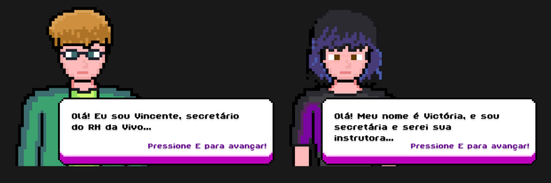

# GDD - Game Design Document - Módulo 1 - Inteli

## Share Experience

# Nomes dos integrantes do grupo

Bruno Gabriel Giordano Guilherme Kadayan 

Francisco de Araújo Ferreira Filho

Gabriel Leon Lima Costa

Giacomo Zema Matizonkas

João Pedro Gonçalves Corrêa Araujo

Maria Vitória dos Santos

Pedro Jorge Alves Soares

Victor Garcia Dos Santos

## Sumário

[1. Introdução](#c1)

[2. Visão Geral do Jogo](#c2)

[3. Game Design](#c3)

[4. Desenvolvimento do jogo](#c4)

[5. Casos de Teste](#c5)

[6. Conclusões e trabalhos futuros](#c6)

[7. Referências](#c7)

[Anexos](#c8)

 

# 1. Introdução (sprints 1 a 4)

## 1.1. Plano Estratégico do Projeto

### 1.1.1. Contexto da indústria

A Vivo é uma das principais empresas de telecomunicações do Brasil, oferecendo serviços de telefonia, internet e TV. Seu propósito, “Digitalizar para Aproximar”, reforça o compromisso com a inovação e a conectividade. Em um setor altamente competitivo, com players como Claro, TIM e Oi, a Vivo se destaca pelo investimento em tecnologia e serviços digitais.

Além disso, a empresa valoriza o desenvolvimento de seus colaboradores, fortalecendo sua cultura organizacional. O serious game de carreira torna o aprendizado mais interativo e acessível, incentivando o crescimento interno e a retenção de talentos, alinhando-se à estratégia da empresa.

#### 1.1.1.1. Modelo de 5 Forças de Porter

## Análise da Rivalidade entre os Concorrentes Existentes

### Telecomunicações: Moderado/Baixo

Essa classificação se dá pelo fato de existirem poucas empresas de grande porte no setor de telecomunicações que possam concorrer com a Vivo. 

### Entretenimento: Alta

Essa classificação se justifica pela presença de diversas empresas renomadas nesse setor, como Prime Video, Max e Netflix, que já são amplamente reconhecidas na área.

### Finanças: Alta

Além da enorme competitividade com outros grandes bancos, a Vivo é mais reconhecida por sua atuação em outros setores, como telecomunicações, internet banda larga fixa e internet móvel. Por esse motivo, os usuários tendem a preferir bancos mais tradicionais para investir seu dinheiro. Dessa forma, a classificação para esse tipo de concorrência é elevada.

## **Análise do Poder de Barganha dos Clientes**

### Telecomunicações: Baixo

Como citado anteriormente, a Vivo é amplamente reconhecida pelos serviços de internet banda larga fixa e rede móvel. Nesses setores, os clientes confiam bastante na empresa, e há poucas grandes concorrentes. Além disso, em muitas zonas rurais, as pessoas frequentemente não têm opções de provedores de internet, o que reforça a presença da Vivo nesses locais.

### Entretenimento: Alta

Como nesses setores há muitas empresas renomadas oferecendo conteúdos de qualidade, o poder de barganha dos clientes é alto, pois eles têm diversas opções com diferentes formatos e faixas de preço.

### Finanças: Alta

Pelo mesmo fator do entretenimento, o setor financeiro também conta com diversas opções, desde bancos tradicionais até bancos digitais, que ganharam muito espaço recentemente. Com isso, o poder de barganha dos clientes é alto, e as empresas competem intensamente para atrair e reter usuários.

## **Análise da Ameaça de Novos Entrantes**

### Telecomunicações: Baixo

A ameaça de novos entrantes é baixíssima, considerando a dificuldade de criar uma empresa de telecomunicações e o alto capital necessário para torná-la competitiva, fatores que limitam a concorrência no setor.

### Entretenimento: Alta

A ameaça de novos entrantes é altíssima, pois, na internet, é fácil para uma empresa desenvolver um software voltado ao entretenimento. Além disso, hoje existem várias fontes de entretenimento voltadas para redes sociais, sem a necessidade de ser uma empresa e gastar milhões para produzir conteúdo.

### Finanças: Moderado/Alto

Do mesmo modo, o avanço tecnológico facilitou significativamente a criação de bancos modernos. Ao contrário do passado, quando era necessária uma infraestrutura extensa, os bancos digitais facilitaram a entrada de novos concorrentes no setor.

## **Análise da Ameaça de Produtos ou Serviços Substitutos**

### Telecomunicações: Baixo/Moderado

A ameaça de novos produtos ou serviços na área de telecomunicações é baixa, pois a Vivo é uma empresa consolidada com uma forte reputação no mercado. Além disso, a empresa possui a melhor infraestrutura de fibra óptica do Brasil. No entanto, é importante considerar o avanço da Starlink, que, embora não represente uma ameaça no curto prazo, pode se tornar competitiva a longo prazo conforme sua tecnologia evolui.

### Entretenimento: Alta

O setor de entretenimento é altamente dinâmico, influenciável e relativamente acessível, o que resulta em uma alta ameaça de novos produtos ou serviços surgindo a qualquer momento.

### Finanças: Moderado/Alta

Como citado anteriormente, o cenário financeiro tornou-se altamente mutável após a revolução tecnológica. Com a maior facilidade para criação e gerenciamento de bancos digitais, diversas empresas estão atentas a esse ambiente competitivo e investem fortemente em inovação.

## **Análise do Poder de Barganha dos Fornecedores**

### Telecomunicações: Baixo

O poder de barganha dos fornecedores no setor de telecomunicações é baixo, devido à grande quantidade de empresas que podem fornecer matérias-primas para a Vivo, tanto no Brasil quanto globalmente, como cobre, componentes eletrônicos e semicondutores.

### Entretenimento: Alta

No setor de entretenimento, o poder de barganha dos fornecedores é muito alto, pois a Vivo não tem controle sobre o que vai se tornar viral. Quando isso acontece, o fornecedor da série ou filme pode disponibilizar o conteúdo em várias plataformas, e a Vivo se vê obrigada a adquirir os direitos, já que está em evidência e chamará a atenção do público.

### Finanças: Moderado/Alta

Novamente, nesse cenário, devido à alta disponibilidade de empresas de tecnologia no setor, o poder de barganha das empresas tende a ser moderado/alto, pois, embora haja uma grande oferta, algumas empresas se especializam em soluções mais específicas, tornando-as mais adequadas para certos tipos de problemas.

### 1.1.2. Análise SWOT

# **Ambiente Interno**

---

## **S (Strengths) - Forças**

A Vivo se destaca pela diversidade de produtos, liderança em telefonia móvel, forte marca, sustentabilidade e infraestrutura avançada, oferecendo fibra óptica de alta qualidade e inovação contínua.

## **W (Weaknesses) - Fraquezas**

A Vivo enfrenta desafios como alto turnover, elevados custos operacionais, transição digital complexa e dificuldades na expansão do sinal em regiões remotas, impactando sua competitividade.

---

# **Ambiente Externo**

## **O (Opportunities) - Oportunidades**

A Vivo pode crescer com IA para otimizar atendimento, digitalização para reduzir custos e a alta demanda por internet, expandindo fibra óptica e 5G em novas regiões.
### **T (Threats) - Ameaças**

A Vivo enfrenta ameaças como a concorrência da Starlink e da internet via satélite, investimentos de rivais como Claro e TIM e inovações tecnológicas que reduzem a dependência de operadoras.

### 1.1.3. Missão / Visão / Valores

# Missão:

Universalizar as oportunidades do mundo digital, atuando como uma força transformadora para empresas e pessoas. Por isso, a Vivo promove a digitalização para milhões de brasileiros.

# Visão:

A Vivo busca um futuro em que a tecnologia seja mais afetiva, consolidando-se como a líder na digitalização do Brasil. 

# Valores:

- Compromisso com a sustentabilidade.
- Responsabilidade corporativa.
- Oferecer serviços confiáveis, fáceis e eficientes.
- Valorizar a diversidade e contar com uma equipe de colaboradores talentosos.

### 1.1.4. Proposta de Valor (sprint 4)

*Posicione aqui o canvas de proposta de valor. Descreva os aspectos essenciais para a criação de valor da ideia do produto com o objetivo de ajudar a entender melhor a realidade do cliente e entregar uma solução que está alinhado com o que ele espera.*

### 1.1.5. Descrição da Solução Desenvolvida (sprint 4)

Tendo em vista que a Vivo tem enfrentado dificuldades em alcançar todos os seus colaboradores com programas de desenvolvimento de carreira devido à falta de uma abordagem estruturada e interativa, nosso serious game chamado "Work XP" traz a proposta de apresentar todas as etapas essenciais do desenvolvimento de carreira, desde as vagas até o planejamento de crescimento e desenvolvimento contínuo, de forma dinâmica e interativa. Por isso, nosso jogo é ambientado no prédio da Vivo e conta com personagens jogáveis com características diferentes para que os colaboradores da Vivo possam escolher com qual eles mais se identificam, além de NPCs que ajudam o jogador a entender o jogo e a jogar da melhor forma.

### 1.1.6. Matriz de Riscos (sprint 4)

*Registre na matriz os riscos identificados no projeto, visando avaliar situações que possam representar ameaças e oportunidades, bem como os impactos relevantes sobre o projeto. Apresente os riscos, ressaltando, para cada um, impactos e probabilidades com plano de ação e respostas.*

### 1.1.7. Objetivos, Metas e Indicadores (sprint 4)

*Definição de metas SMART (específicas, mensuráveis, alcançáveis, relevantes e temporais) para seu projeto, com indicadores claros para mensuração*

## 1.2. Requisitos do Projeto
Os requisitos do projeto definem as funcionalidades essenciais do jogo, especificando o que ele deve conter para proporcionar uma experiência completa ao usuário. Esses requisitos incluem mecânicas de gameplay, interface, desempenho e outros aspectos fundamentais para o funcionamento do jogo.
Ao analisar o TAPI do jogo e discuti-lo com o parceiro no kick-off, a equipe identificou, nesta primeira Sprint, os principais desafios a serem abordados na definição dos requisitos. Os principais desafios incluíram a necessidade de envolver os colaboradores no jogo e garantir que eles absorvam conceitos sobre progressão de carreira por meio da experiência dentro do jogo.

Com base nesses desafios, foram desenvolvidos os seguintes requisitos:
\# | Requisitos  
--- | ---
R01 | O jogo deve ter movimentação de personagem pelas teclas WASD para navegação pelas fases
R02 | O jogo deve possuir uma tela de ínicio com configurações e créditos
R03 | O jogo deve ter uma história  que entretenha os colaboradores
R04 | O jogo deve possuir 3 fases que ajudem os colaboradores a entender sobre a progressão de carreira
R05 | O jogo deve possuir pelo menos uma função de acessibilidade
R06 | O jogo deve possuir diversidade visível nos seus personagens
R07 | O jogo deve possuir uma ambientação dentro da empresa
R08 | A documentação do jogo deve ter desenvolvimento contínuo e organizado.
R09 | O jogo deve possuir uma tela de escolha de personagem
R10 | O código do jogo deve possuir as boas práticas da programação, como nomeação de variáveis e comentarios

## 1.3. Público-alvo do Projeto

O público-alvo do jogo desenvolvido para abordar o problema de engajamento dos colaboradores da Vivo no desenvolvimento de carreira é composto por funcionários da empresa que enfrentam dificuldades para navegar pelas oportunidades internas de crescimento devido à falta de uma abordagem estruturada e interativa.

Esse público encontra-se em uma faixa etária predominantemente adulta, com idades entre 20 e 45 anos.

Quanto ao gênero, não há restrições, pois a Vivo conta com um quadro de funcionários diverso e inclusivo. Da mesma forma, a localização geográfica é ampla, abrangendo colaboradores em todo o Brasil, atuando presencialmente, em regime híbrido ou remoto.

Por fim, é necessário destacar que, por conta da rotina dinâmica dos colaboradores, eles valorizam soluções que sejam acessíveis, eficientes e práticas, permitindo que desenvolvam suas carreiras de maneira engajadora e intuitiva. Além disso, a abordagem gamificada do projeto favorece a absorção do conteúdo de forma interativa, incentivando o aprendizado contínuo.

# 2. Visão Geral do Jogo
O jogo tem o objetivo de transformar o desenvolvimento de carreira dos colaboradores da Vivo em uma experiência educativa e engajante, por meio de um serious game interativo e imersivo. O jogo guia o usuário por uma jornada estruturada em módulos, representando etapas essenciais para o crescimento profissional dentro da empresa. Cada módulo foi projetado para oferecer conhecimento prático sobre planejamento de carreira, recrutamento interno, desenvolvimento de habilidades e estratégias para a evolução profissional, tornando o aprendizado mais dinâmico e acessível.

Por meio dessa abordagem gamificada, espera-se aumentar o engajamento dos colaboradores com os programas de desenvolvimento de carreira da Vivo, promovendo uma experiência mais eficaz e atrativa para impulsionar o crescimento profissional dentro da organização.

## 2.1. Objetivos do Jogo

O jogador deve progredir no jogo completando desafios e interagindo com os conteúdos apresentados. Cada etapa concluída desbloqueia novas fases, recompensas e elementos interativos, permitindo que o jogador avance até a finalização do jogo. O progresso pode ser acompanhado por meio de um sistema de pontuação, conquistas ou pela conclusão de módulos específicos.

Além disso, a cada objetivo cumprido, o jogador receberá um carimbo como forma de bonificação. Esses carimbos representam a validação do progresso e são necessários para avançar para a última fase do jogo.

A primeira fase será focada na Preparação para a Jornada – Currículo e Candidatura. Nessa etapa, os jogadores aprenderão a estruturar um currículo eficaz e otimizado para sistemas de recrutamento. Eles enfrentarão desafios práticos, como criar ou aprimorar um currículo, enviar uma simulação de candidatura e receber feedback com sugestões de melhorias.

As fases seguintes ainda estão em processo de definição e poderão incluir novas mecânicas e desafios alinhados aos objetivos do jogo.

## 2.2. Características do Jogo

### 2.2.1. Gênero do Jogo

De acordo com as preferências da Vivo, o gênero escolhido foi o *serious game*. Esse tipo de jogo tem como propósito principal educar ou treinar os jogadores em áreas específicas, combinando elementos interativos e envolventes para garantir o engajamento. No contexto do projeto, o serious game foi escolhido como a abordagem ideal para apoiar os colaboradores no desenvolvimento de carreira, explorando temas como planejamento de crescimento profissional, habilidades essenciais e processo seletivo interno.

### 2.2.2. Plataforma do Jogo

O jogo poderá ser executado em qualquer plataforma desktop com um navegador web ou em dispositivos móveis, como celulares e tablets, que rodem Android ou iOS e tenham suporte a navegadores.

O Work XP foi testado nos seguintes sistemas:

\# | Plataforma | SO | Nome | Funcionamento 
--- | --- | --- | --- | --- 
1 | Desktop e Mobile | Windows, MacOS, Android e iOS | Google Chrome | ✅ 
2 | Desktop e Mobile | Windows, MacOS, Android e iOS | Mobzilla | ✅ 
3 | Desktop e Mobile | Windows, MacOS, Android e iOS | Microsoft Egde | ✅ 
4 | Desktop e Mobile | Windows, MacOS, Android e iOS | Opera | ✅ 
5 | Desktop e Mobile | Windows, MacOS, Android e iOS | Opera GX | ✅ 
6 | Desktop e Mobile | Windows, MacOS, Android e iOS | Brave | ✅ 
7 | Desktop e Mobile | Windows, MacOS, Android e iOS | Safari | ✅ 

### 2.2.3. Número de jogadores

A experiência será individual, ou seja, um único jogador por sessão. Essa decisão visa proporcionar uma jornada personalizada, focada no desenvolvimento de carreira dos colaboradores da Vivo, garantindo um aprendizado mais imersivo e alinhado às necessidades de cada participante.

### 2.2.4. Títulos semelhantes e inspirações 

O público-alvo do jogo é amplo, abrangendo pessoas de todas as idades. Por isso, buscamos criar uma experiência que gerasse identificação e conexão com os jogadores. A escolha da *pixel art* remete à nostalgia dos clássicos, evocando a estética dos jogos retrô.

Os personagens foram inspirados no estilo visual da franquia *Pokémon*, especialmente nos títulos lançados para *Game Boy Advance* e *Nintendo DS* entre 2002 e 2006, com destaque para os *sprites* utilizados na movimentação. Pokémon é uma franquia na qual os jogadores assumem o papel de treinadores que capturam e treinam criaturas chamadas Pokémon, embarcando em jornadas para se tornarem campeões e enfrentando desafios ao longo do caminho.

Já a ambientação do nosso jogo foi desenvolvida com base em *Undertale* (2015), que conta a história de uma personagem que cai em um mundo subterrâneo e precisa encontrar uma forma de escapar. Inspiramo-nos em seu visual simples e colorido, que contribui para uma atmosfera envolvente e cativante, para criar uma estética mais leve e acessível no *Work XP*.

Figura 1: Sprites de personagens em pixel art dos jogos da franquia Pokémon.

Figura 2: Ambiente interno característico do mundo subterrâneo de Undertale.

### 2.2.5. Tempo estimado de jogo (sprint 5)

*Ex. O jogo pode ser concluído em 3 horas passando por todas as fases.*

*Ex. cada partida dura até 15 minutos*

# 3. Game Design 

## 3.1. Enredo do Jogo 

O jogo se passa dentro da Vivo, proporcionando uma experiência imersiva aos jogadores. O cenário foi elaborado para refletir a realidade de um ambiente corporativo moderno, onde os jogadores podem  explorar diferentes setores, interagir com elementos que representam os desafios do cotidiano profissional e buscar maneiras de crescimento dentro da organização. A aventura começa com uma cutscene que exibe a cidade de São Paulo em movimento. O carro do jogador percorre uma avenida movimentada, passando por prédios, casas e comércios, até chegar à sede da Vivo. Essa introdução contextualiza o ambiente urbano e prepara o jogador para sua jornada.

Ao entrar no prédio da Vivo, o jogador joga com um personagem que já é um colaborador da Vivo, e é recebido na recepção, onde encontra, à mesa, um NPC que representa um secretário. Essa área funciona como ponto de partida, onde o recepcionista explica as dinâmicas e desafios do jogo. No fundo da recepção, o jogador acessa um corredor que leva às salas da empresa. Cada sala representa uma fase do jogo, onde o jogador enfrentará desafios, aprenderá sobre os processos internos da Vivo e desenvolverá novas habilidades para alavancar sua carreira dentro da organização. O design do mundo do jogo foi pensado para proporcionar uma experiência envolvente, permitindo que os jogadores explorem o ambiente de forma intuitiva e conectem sua jornada virtual ao desenvolvimento real de carreira dentro da empresa.

## 3.2. Personagens (sprints 3)

### 3.2.1. Controláveis

No serious game desenvolvido para a Vivo, o jogador terá a possibilidade de selecionar o personagem que o representará na jornada de desenvolvimento de carreira. Os personagens disponíveis foram criados para refletir a diversidade promovida pela empresa em seu ambiente organizacional.

## Personagens Disponíveis

Atualmente, há dois personagens jogáveis, e outros dois serão adicionados futuramente:

- **Vitor**: Um jovem profissional que busca crescimento na empresa e deseja desenvolver suas habilidades interpessoais e técnicas para alcançar novas oportunidades.
- **Vivian**: Uma colaboradora que busca aprimorar sua capacidade de liderança e explorar diferentes áreas da organização.

Os personagens não possuem habilidades especiais que afetem a *gameplay*, pois o foco do jogo está na experiência de aprendizado e no desenvolvimento de carreira. As diferenças entre os personagens são apenas visuais, permitindo que o jogador escolha aquele com quem mais se identifica.

## Equidade na Experiência de Jogo

A ausência de poderes ou habilidades diferenciadas entre os personagens foi uma escolha de design para garantir equidade na experiência dos jogadores, evitando vantagens ou desvantagens baseadas na escolha do avatar. Isso reforça a ideia de que o crescimento na carreira depende das decisões e ações do jogador, e não de atributos pré-definidos.

#### **Imagens**

#### Vitor

#### Vivian

### 3.2.2. Non-Playable Characters (NPC)

Atualmente, há dois **NPC** presente no jogo:

| **Nome**        | **Função**                      | **Descrição** |
|---------------|-----------------------------|--------------|
| **Recepcionista** | Personagem fixo na recepção | Um colaborador que recebe os jogadores ao entrarem no ambiente do jogo. |
| **Victoria** | Personagem de diálogo da fase 1 | Uma repepcionista da Vivo que auxilia o jogador durante a primeira fase do jogo |

O **Recepcionista** foi criado para trazer **imersão ao ambiente do jogo**, simulando um espaço corporativo real. Embora, no momento, ele **não tenha funcionalidades interativas**, a equipe pretende desenvolver diálogos e interações futuras, como:
- Fornecimento de informações sobre o jogo e seus módulos.
- Direcionamento dos jogadores para diferentes áreas do ambiente virtual.
- Possível participação em desafios ou missões dentro do jogo.

#### **Imagens**

### 3.2.3. Diversidade e Representatividade dos Personagens

Pensando no quadro de colaboradores representativo da Vivo e na melhor forma de trazer identificação por meio do jogo, propomos a exibição desse quadro de duas maneiras: com personagens jogáveis e com uma ambientação interativa e estática.

Analisando o contexto brasileiro e a distribuição étnica com base no Censo de 2022, observamos que 92,1 milhões de brasileiros (45,3% do total) se declararam pardos, ante 88,3 milhões de brancos (43,5%). Pensando nisso, a construção dos personagens jogáveis foi feita considerando etnia, faixa etária e diversidade de gênero, resultando na escolha de quatro personagens: Vivian, uma mulher jovem, negra; Vitor, um homem pardo, com cabelo estilizado em black power; Violeta, uma mulher madura, branca e com cabelos grisalhos e Vini, um homem de aparência madura, preto e com cabelos grisalhos.

A ambientação do jogo seguirá duas abordagens para representar a acessibilidade no ambiente da Vivo. Primeiro, o jogador poderá interagir com NPCs que apresentam características não abrangidas pelos personagens jogáveis, incluindo pessoas com deficiência (PCDs) e indivíduos de diferentes etnias, sem exigir esforços específicos para o desenvolvimento das artes dos personagens jogáveis, ao mesmo tempo em que os insere na ambientação.

Além disso, à medida que explora o mundo do jogo, o jogador perceberá elementos visuais que reforçam a diversidade e inclusão, como quadros, bandeiras LGBTQIAPN+ e outras representações distribuídas pelos ambientes.

Fonte:https://www.bbc.com/portuguese/articles/c4nyekzdd16o#:~:text=Em%202022%2C%2092%2C1%20milh%C3%B5es,milh%C3%B5es%20para%20203%2C1%20milh%C3%B5es.

## 3.3. Mundo do jogo

### 3.3.1. Locações Principais e/ou Mapas

O jogo começa com uma cutscene ambientada em uma avenida de São Paulo. O carro do jogador percorre a avenida, passando por casas e estabelecimentos, até chegar ao prédio da empresa.

Ao entrar no local, o jogador inicia sua jornada na recepção da instituição, onde há uma mesa de recepcionista e um NPC representando o secretário.

Seguindo para o fundo da cena, ele acessa uma segunda área que leva às salas da empresa, que representam as entradas para as fases do jogo.

\# | Ambientação | Responável | Fonte dos material | Plataforma utilizada
--- | --- | --- | --- | --- 
1 | Cidade | Bruno Kadayan | Pixel.haus | Pixel Studio
2 | Recepção | João Pedro | https://limezu.itch.io/moderninteriors | Sprite fusion
3 | Salas | João Pedro | https://limezu.itch.io/moderninteriors | Sprite fusion

Revela-se, portanto, o prólogo do jogo, que conta com três áreas diferentes para situar o jogador no início de sua jornada.

### 3.3.2. Navegação pelo mundo

Ao pressionar o botão 'Iniciar', o jogador é direcionado à tela de escolha de personagens. Após selecionar o protagonista da história e clicar em 'Continuar', o jogador é levado para a cutscene, que é exibida automaticamente, a menos que ele opte por pulá-la pressionando a tecla 'E'.
Após essa cena, o jogador aparece na recepção da empresa, podendo se mover pelas setas do teclado ou pelas teclas WASD. Para interações com elementos do cenário, como o recepcionista, basta pressionar 'E'. Ao explorar a recepção e avançar para a parte de trás, o jogador poderá interagir com as portas para acessar os níveis do jogo.

### 3.3.3. Condições climáticas e temporais

A história ocorre durante o dia, o que pode ser percebido na cutscene. No entanto, não há condições temporais ou climáticas que influenciem as fases do jogo.

### 3.3.4. Concept Art

O jogo se passa em cenas, as quais o jogador pode interagir.

Figura 1: Ao abrir o link do jogo, o usuário se depara com uma tela pré-inicial para abrir a tela inicial.

Figura 2: Ao clicar com o mouse na tela pré-inicial, a tela inicial se abre.

Figura 3: Clicando no botão do canto superior direito da tela inicial, o jogador é direcionado para a área de configurações do jogo.

Figura 4: Clicando no botão "Créditos", o jogador é direcionado para os créditos do jogo.

Figura 5: Clicando no botão "Iniciar", o jogador é direcionado para a tela de escolha de personagens, sendo apresentado a personagem escolhida para jogar no centro da tela, as setas laterais para alterar o personagem escolhido e um botão abaixo para continuar o jogo.

Figura 6: Clicando no botão "Continuar", o jogador é direcionado para a tela de cutscene do jogo, a qual apresenta uma introdução da história apresentada e um tutorial explicando que, se caso o usuário queira, ele pode pular essa tela apertndo a tecla "E".

Figura 7: Após a cut scene, o usuário vai automaticamente para a recepção da empresa, onde há sofás, tapete e uma mesa de recepção com o recepcionista da empresa, além de um título a esse capítulo, intitulado de "Prólogo".

Figura 8: Automaticamente, ainda na recepção da empresa, aparece um diálogo que pergunta ao usuário se ele quer ser apresentado ao tutorial do jogo, se ele escoher a opção "Não", ele é direcionado para continuar normalmente a explorar a sala, caso a opção escolhida seja a "Sim", um tutorial começa a aparecer.

Figura 9: O tutorial do jogo começa a ser apresentado, sendo composto por duas partes, a primeira apresentando que a tecla "E" interage com o jogo e a segunda apresentando as teclas de movimentação. Ambas as partes são passáveis se o jogador apertar "E".

Figura 10: Após o tutorial, se caso o jogador avançar para o fundo da recepção, ele passa para uma parte da recepção onde há sofás, um tapete e plantas para a ambientação do cenário. Além das portas das salas que, futuramente, levará paras as fases jogáveis.

Essas cenas compõem o início e o prólogo do jogo, introduzindo o jogador à sua jornada de aprendizado e desenvolvimento.

### 3.3.5. Trilha sonora 
| \# | Título | Ocorrência | Autoria |
| --- | --- | --- | --- |
| 1 | Tema de abertura | Tela de início | Não possui o nome do autor. A música se encontra no site:https://pixabay.com/pt/music/search/8bit/ |
| 2 | Introdução da história | Cena de transição | Não possui o nome do autor. A música se encontra no site:[https://pixabay.com/pt/music/search/motor/](https://pixabay.com/pt/sound-effects/search/motor/) |
| 3 | Prólogo  | Recepção do jogo | Não possui o nome do autor. A música se encontra no site:https://pixabay.com/pt/music/search/8bit/ |

## 3.4. Inventário e Bestiário 

### 3.4.1. Inventário

### 3.4.2. Bestiário

## 3.5. Gameflow (Diagrama de cenas)

O diagrama do jogo atualmente conta com as cenas introdurias, de configuração e as primeiras bases jogavéis. Link do figma em alta resolução: https://www.figma.com/board/QHsjMwhRNhujM5WBshjkii/Untitled?node-id=0-1&t=IysbkfVdtv4QJXjr-1

## 3.6. Regras do jogo 

O jogador deve avançar por diversas fases, cada uma projetada para ensinar sobre a Vivo e suas trilhas de forma dinâmica e envolvente. Cada fase apresenta um estilo de jogo único, garantindo variedade e desafio ao longo da jornada.

1ª fase (Implementada): O jogador é introduzido a uma gama de opções para preencher o currículo, com descrições que combinam exatamente com cada seção do currículo. Enquanto o jogador escolhe as opções, ele vê, no centro superior da tela, uma barra de progresso que, conforme atinge a melhor combinação das respostas, vai se aproximando de 100%. Quanto mais longe, mais próximo de 0%. O jogador vence o jogo quando preenche as seções do currículo com a barra de progresso completa, indicando, até o momento, sua experiência, se já trabalhou na área, o nível de inglês e seu contato.

2ª fase (*Concept*): Na segunda fase, o jogador é inserido dentro de um labirinto desafiador, representando os desafios e obstáculos de um processo seletivo. O objetivo é encontrar a saída enquanto evita inimigos e coleta itens essenciais. Os inimigos, que simbolizam concorrentes, nervosismo e imprevistos, devem ser evitados para não atrasar o progresso.

3ª fase (*Concept*): Na terceira fase, o jogador enfrenta um *quiz* interativo que representa a etapa final da entrevista. Ele deve responder corretamente a perguntas de múltipla escolha relacionadas ao case apresentado, com um tempo limite para cada resposta.

Com essas três fases, o jogador percorre uma jornada completa sobre o processo seletivo da Vivo, aprendendo sobre múltiplos processos de forma criativa e envolvente.

## 3.7. Mecânicas do jogo 

Na criação de jogos, a movimentação assume uma função essencial ao ambientar o jogador no jogo e demonstrar as primeiras mecânicas de como ele irá interagir com o novo mundo que encontrou.

O jogo foi pensado inspirado na movimentação de jogos como pokemon e undertale, que possuem uma movimentação inicial para o jogador interagir e se deslocar em ambientes, em cenas que não necessariamente possuem uma função jogável, mas podem possuir interação para irem para um minigame, ou adquirirem informação.

Na ambientação, o jogador pode usar as teclas WASD e as setas do teclado para as mecânicas de andar, para 4 dimensões, cima, baixo e horizontalmente. Além disso para interagir com NPC´s é utilizada a tecla E, também usado para outras interações como pular cut-scenes e passar para próxima caixa de texto. Já nos minigames, ele tem a opção de escolher a resposta com o clique do *mouse*.

A escolha da movimentação e interação, foram feitas com o intuito de resgatar o uso de outras experiências do usuário com outros jogos para a melhor curva de aprendizagem e adaptação as mecânicas do jogo.

## 3.8. Implementação Matemática de Animação/Movimento 

*Descreva aqui a função que implementa a movimentação/animação de personagens ou elementos gráficos no seu jogo. Sua função deve se basear em alguma formulação matemática (e.g. fórmula de aceleração). A explicação do funcionamento desta função deve conter notação matemática formal de fórmulas/equações. Se necessário, crie subseções para sua descrição.*

# 4. Desenvolvimento do Jogo

Nesta seção, abordamos o processo de desenvolvimento do jogo, detalhando as etapas desde a concepção da ideia até a implementação das primeiras funcionalidades. O objetivo é criar uma experiência interativa e educativa que auxilie os colaboradores da Vivo no processo de transição de setor dentro da empresa.

O desenvolvimento do jogo foi estruturado em sprints, permitindo ajustes contínuos com base nos *feedbacks* e nas necessidades identificadas ao longo do projeto. Cada sprint tem entregas específicas, avançando progressivamente na construção do jogo.

## 4.1. Desenvolvimento preliminar do jogo

**Visão Geral do Projeto**
Inicialmente, concebemos um jogo com 6 fases (cada uma representando um módulo), onde a história acompanharia um novo aplicante sem histórico de trabalho na Vivo. Esse candidato passaria por todo o processo seletivo, ensinando ao jogador dicas valiosas sobre como se destacar na seleção.

Porém, após o kick-off, ajustamos o planejamento para um jogo com 3 fases (uma a cada dois módulos). A nova abordagem acompanha um trabalhador já inserido na Vivo, que deseja mudar de setor em função de ter atingido o limite possível no mesmo.

**O Que Foi Entregue Nesta Sprint**
  Roteiro do Jogo: após algumas alterações, conseguimos definir uma história interessante para o jogador, alinhada aos requisitos da empresa.

   **4.1.1-Definição da Mecânica Principal** : o jogo seguirá um formato baseado em decisões, no qual o jogador aprenderá sobre o processo de transição de setor na empresa.

   **4.1.2-Tela Inicial do Jogo**: Implementamos a interface inicial utilizando Phaser.js, criando um layout interativo e intuitivo.
   

   **4.1.3-Cutscene**: Incluímos uma cena cinematográfica introdutória ao jogo.
   

   **4.1.4-Navegação Básica**: Foi desenvolvida uma maneira de transitar entre partes da interface por meio de botões.
   

   **4.1.5-Creditos**: Incluímos os créditos de todos os desenvolvedores do jogo.
    
   
   **4.1.6-Prólogo**: Primeiro momento em que o jogador recebe controle sobre a personagem.
   

   **4.1.5-Tutorial**: Introduzimos um tutorial interativo que ensina o jogador as mecânicas básicas do jogo.
   
   
   

## 4.2. Desenvolvimento básico do jogo

**O Que Foi Entregue Nesta Sprint**: Realizamos adaptações em mecânicas já presentes no jogo, assim como a implementação de novas funcionalidades.

**4.2.1-Tela de Seleção de Personagem**: A tela de seleção de personagem foi desenvolvida para permitir que os jogadores escolham entre diferentes personagens jogáveis, proporcionando ao usuário uma experiência mais diversa e completa.

**4.2.2-Reformulação da Cutscene**: A cutscene passou por alguns ajustes. Alteramos o spritesheet do carro e o fundo da cidade, visando alcançar um produto mais estético e agradável aos olhos. Além disso, também implementamos caixas de texto nessa cena para contextualizar o jogador sobre a história do jogo.

**4.2.3-Novo Personagem Jogável**: Foi desenvolvida a arte de um novo personagem jogável, com o objetivo de fornecer opções ao jogador quanto ao avatar ele irá utilizar, por meio da 'tela de seleção de personagens'.

**4.2.4-Ambiente: Recepção**: Após a cutscene inicial, a personagem irá adentrar na recepção, onde poderá escolher se deseja realizar o tutorial ou não. Além disso, a presença de portas permite que o jogadores escolha a fase que irá jogar de forma interativa.

**4.2.5-Adaptação Quanto ao Uso da Logo VIVO**: Foi prevista a necessária alteração de algumas logos e designs que violavam o código de conduta e bom uso da Vivo.

**4.2.6-Desenvolvimento de NPCs**: Novos NPCs foram criados para enriquecer a interação dentro do jogo, e serão implementados diálogos básicos para ajudar o jogador a progredir e entender o jogo.

**4.2.7-Adaptação do jogo para Mobile**: Pensando na praticidade e viabilidade do jogo para os colaboradores, trabalhamos para torná-lo disponível também para dispositivos móveis, por meio de uma tela interativa.

## 4.3. Desenvolvimento intermediário do jogo 

&nbsp;&nbsp;&nbsp;&nbsp;Durante a Sprint 3,  estamos focados na implementação da primeira fase do jogo, que corresponde a Preparação para a Jornada e melhorar elementos do jogo. O objetivo dessa etapa é ensinar aos jogadores como construir um currículo eficiente e otimizado para processos seletivos, utilizando dicas interativas e desafios práticos.

Lista de adições da terceira Sprint: 
	
**4.3.1 - Design e programação da Fase 1:** Design e desenvolvimento da interface da primeira fase jogável, que inclui orientações sobre a criação de currículo e desafios interativos, nos quais o jogador pode identificar erros e acertos em currículos fictícioso.

&nbsp;&nbsp;&nbsp;&nbsp;A Figura 1 abaixo ilustra a nova interface da primeira fase do jogo.

   
    
   
Fonte: Material produzido pelos autores (2025)

**4.3.2 - Novo personagem jogável:** Criação de um novo personagem jogável chamado Vinícius. Ele é um personagem mais velho e experiente para representar um possível público com essa faixa-etária.

&nbsp;&nbsp;&nbsp;&nbsp;A Figura 2 abaixo ilustra a spritesheet do novo personagem do jogo, Vinícius. Ele ainda não foi adicionado na programação.

   
    
   
   Fonte: Material produzido pelos autores (2025)

   

**4.3.3 - Novo NPC:** Design da nova NPC chamada Victoria. Ela auxiliará o jogador na primeira fase na construção do currículo. 

&nbsp;&nbsp;&nbsp;&nbsp;A Figura 3 abaixo ilustra a nova NPC do jogo, que auxiliará o jogador na primeira fase.

 
   
   Fonte: Material produzido pelos autores (2025)
   

**4.3.4 - Mudança do Tutorial:** Re-design do tutorial para deixar a caixa de texto mais bonita, informativa e padronizada de acordo com os outros elementos do jogo.

&nbsp;&nbsp;&nbsp;&nbsp;A Figura 4 abaixo mostra o novo design do tutorial. 

   
    
   
   Fonte: Material produzido pelos autores (2025)
   

**4.3.5 - Caixas de Diálogo:** Foram adicionados dois novos diálogos com o intuito de deixar o jogo mais explicativo para os jogadores. O primeiro se encontra na recepção inicial, em que o jogador conversará com o NPC Vincente sobre como prosseguir para a central e iniciar cada uma das fases. O segundo fica no início da fase Um, onde o jogador conversa com a nova NPC Victoria que instrui o jogador sobre as funcionalidades desse nível do jogo.

&nbsp;&nbsp;&nbsp;&nbsp;A Figura 5 abaixo demonstra as novas caixas de diálogos adicionados ao jogo.

 

&nbsp;&nbsp;&nbsp;&nbsp;A Figura 6 mostra o novo sistema de Passaporte e o sistema de conquistas que o jogador ganhará após cada fase.

**4.3.6 - Passaporte e Bagdes:** Foi implementado um novo sistema de conquistas, onde a cada fase concluída o jogador ganhará um Bagde no seu passaporte, que representa que ele concluiu a respectiva fase. No final do jogo, caso o jogador possua todos os bagdes,  uma fase bônus é liberada.

 
   
   Fonte: Material produzido pelos autores (2025)

**4.3.7 - Re-Design NPC:** Alteração no completo do NPC Vicente. Essa reformulação teve o propósito de deixá-lo mais amigável, simpático e padronizado com as outras figuras do jogo.

&nbsp;&nbsp;&nbsp;&nbsp;A Figura 7 demonstra como o recepcionista ficou após o redesign.

 
   
   Fonte: Material produzido pelos autores (2025)

### Próximos passos

&nbsp;&nbsp;&nbsp;&nbsp;Para a próxima sprint, planejamos:
	<li>Finalizar a fase 1, garantindo sua total funcionalidade.</li>
	<li>Iniciar o desenvolvimento das próximas fases, especialmente o Módulo 2 - Cases e Entrevistas.</li>
	<li>Implementar um sistema de recompensas e progressão para aumentar o engajamento dos jogadores.</li>
	<li>Melhorar a acessibilidade do jogo, incluindo a funcionalidade de TTS (Text-to-Speech) para usuários com deficiência visual.</li>
 
&nbsp;&nbsp;&nbsp;&nbsp;Com essas melhorias, buscamos tornar o serious game uma ferramenta cada vez mais interativa e eficaz para os colaboradores da Vivo.

## 4.4. Desenvolvimento final do MVP (sprint 4)

*Descreva e ilustre aqui o desenvolvimento da versão final do jogo, explicando brevemente o que foi entregue em termos de MVP. Utilize prints de tela para ilustrar. Indique as eventuais dificuldades e planos futuros.*

## 4.5. Revisão do MVP (sprint 5)

*Descreva e ilustre aqui o desenvolvimento dos refinamentos e revisões da versão final do jogo, explicando brevemente o que foi entregue em termos de MVP. Utilize prints de tela para ilustrar.*

# 5. Testes

## 5.1. Casos de Teste (sprints 2 a 4)

\# | pré-condição | descrição do teste | pós-condição 
--- | --- | --- | --- 
1 | Posicionar o jogo na tela de abertura | Clicar na tela de abertura | O jogo deve iniciar o menu inicial
2 | Posicionar o jogo na tela inicial | Pressionar o botão de configurações | O jogo deve iniciar a tela de configurações
3 | Posicionar o jogo na tela de configurações | Pressionar o botão de Música | O jogo deve desabilitar/habilitar a música
4 | Posicionar o jogo na tela de configurações | Pressionar o botão de Sons | O jogo deve desabilizar todos os sons do jogo
5 | Posicionar o jogo na tela inicial | Pressionar o botão de sair | O jogo deve retornar ao site da Gupy na página da Vivo no navegador
6 | Posicionar o jogo na tela inicial | Pressionar o botão de créditos | O jogo deve iniciar a tela de créditos
7 | Posicionar o jogo na tela inicial | Pressionar o botão da Vivo | O jogo deve abrir o site da Vivo no navegador
8 | Posicionar o jogo nas telas de configuração ou créditos | Pressionar o botão de voltar | O jogo deve voltar para a tela anterior
9 | Posicionar o jogo na tela inicial | Pressionar o botão de iniciar | O jogo deve iniciar a tela de seleção de personagens 
10 | Estar na tela de seleção de personagem | Pressionar as setas para esquerda ou direita | O jogo deve mudar o personagem 
11 | Estar na tela de seleção de personagem | Pressionar os botões laterais | O personagem da tela deve mudar
12 | Estar na tela de seleção de personagem | Pressionar o botão de continuar | O jogo deve avançar para a cutscene
13 | Estar na tela da cutscene | Pressionar o botão E ou Pular (MOBILE) | O jogo deve finalizar a cutscene e iniciar a tela de prólogo
14 | Posicionar o jogo na tela de cutscene | Aguardar o tempo da cutscene acabar | O jogo deve finalizar a cutscene e iniciar a tela de prólogo
15 | Estar na tela de prólogo | Esperar o tutorial iniciar | O jogo deve exibir o tutorial
16 | Estar na primeira página do tutorial | Pressionar o botão Sim na tela | O jogo deve exibir as próximas etapas do tutorial
17 | Estar na primeira página do tutorial | Pressionar o botão Não na tela | O jogo deve finalizar o tutorial
18 | Estar na segunda página do tutorial | Pressionar o botão E ou Interagir (MOBILE) | O jogo deve avançar o tutorial
19 | Estar na terceira página do tutorial | Pressionar o botão E ou Interagir (MOBILE) | O jogo deve finalizar o tutorial
20 | Estar em um dispositivo Mobile | Finalizar o tutorial, aguardar a última tela sumir | O jogo deve iniciar os botões mobile
21 | Estar em qualquer tela jogável | Pressionar o botão de configurações no topo da tela | O jogo deve iniciar as configurações
22 | Estar em um computador e em qualquer tela jogável | Pressionar o botão W ou seta para cima | O personagem deve andar para cima
23 | Estar em um computador e em qualquer tela jogável | Pressionar o botão A ou seta para esquerda | O personagem deve andar para esquerda
24 | Estar em um computador e em qualquer tela jogável | Pressionar o botão S ou seta para baixo | O personagem deve andar para baixo
25 | Estar em um computador e em qualquer tela jogável | Pressionar o botão D ou seta para direita | O personagem deve andar para direita
26 | Estar em um computador e em qualquer tela jogável | Pressionar o botão E | O personagem interagir como o cenário
27 | Estar em um dispositivo Mobile e em qualquer tela jogável | Pressionar o botão para cima na tela | O personagem deve andar para cima
28 | Estar em um dispositivo Mobile e em qualquer tela jogável | Pressionar o botão para esquerda na tela | O personagem deve andar para esquerda
29 | Estar em um dispositivo Mobile e em qualquer tela jogável | Pressionar o botão para direita na tela | O personagem deve andar para direita
30 | Estar em um dispositivo Mobile e em qualquer tela jogável | Pressionar o botão para baixo na tela | O personagem deve andar para baixo
31 | Estar no cenário do escritório | Se movimentar em direção a algum objeto | O personagem deve colidir com os objetos e não sobrepô-los
32 | Interagir com o recepcionista | Pressionar o botão E ou Interagir (MOBILE) | As falas do recepcionista deve aparecer no jogo
33 | Estar na primeira página da fala do recepcionista | Pressionar o botão E ou Interagir (MOBILE) | O jogo deve avançar o diálogo
34 | Estar na segunda página da fala do recepcionista | Pressionar o botão E ou Interagir (MOBILE) | O jogo deve avançar o diálogo
35 | Estar na terceira página da fala do recepcionista | Pressionar o botão E ou Interagir (MOBILE) | O jogo deve avançar o diálogo
36 | Estar na quarta página da fala do recepcionista | Pressionar o botão E ou Interagir (MOBILE) | O jogo deve finalizar o diálogo
37 | Estar perto da porta 1 | Pressionar o botão E ou Interagir (MOBILE) | A tela do jogo deve mudar para a fase 1
38 | Estar na fase 1 | Pressionar o botão E ou Interagir (MOBILE) | A tela do jogo deve avançar o diálogo
39 | Estar no diálogo da fase 1 | Pressionar o botão E ou Interagir (MOBILE) | A tela do jogo deve avançar o diálogo
40 | Estar no diálogo da fase 1 | Pressionar o botão E ou Interagir (MOBILE) | A tela do jogo deve avançar o diálogo
41 | Estar no diálogo da fase 1 | Pressionar o botão E ou Interagir (MOBILE) | O *minigame* deve começar
42 | Estar no primeiro *minigame* | Pressionar as setas para esquerda ou direita | O jogo deve mudar as opções de resposta
43 | Estar no primeiro *minigame* | Clicar nas palavras em destaque | As palavras deveram ir para o currículo
44 | Estar na tela de *Game Over* | Pressionar o botão de Continuar | O personagem deve voltar para a tela de recepção com as portas para os jogos
45 | Estar na tela de premiação da fase 1 | Pressionar o botão de Continuar | O personagem deve voltar para a tela de recepção com as portas para os jogos
46 | Estar na tela de premiação da fse 1 | Pressionar o botão de Reiniciar | O jogo deve reiniciar o *minigame* 1

## 5.2. Testes de jogabilidade (playtests) (sprint 4)

### 5.2.1 Registros de testes

*Descreva nesta seção as sessões de teste/entrevista com diferentes jogadores. Registre cada teste conforme o template a seguir.*

Nome | João Jonas (use nomes fictícios)
--- | ---
Já possuía experiência prévia com games? | sim, é um jogador casual
Conseguiu iniciar o jogo? | sim
Entendeu as regras e mecânicas do jogo? | entendeu as regras, mas sobre as mecânicas, apenas as essenciais, não explorou os comandos complexos
Conseguiu progredir no jogo? | sim, sem dificuldades  
Apresentou dificuldades? | Não, conseguiu jogar com facilidade e afirmou ser fácil
Que nota deu ao jogo? | 9.0
O que gostou no jogo? | Gostou  de como o jogo vai ficando mais difícil ao longo do tempo sem deixar de ser divertido
O que poderia melhorar no jogo? | A responsividade do personagem aos controles, disse que havia um pouco de atraso desde o momento do comando até a resposta do personagem

### 5.2.2 Melhorias

*Descreva nesta seção um plano de melhorias sobre o jogo, com base nos resultados dos testes de jogabilidade*

# 6. Conclusões e trabalhos futuros (sprint 5)

*Escreva de que formas a solução do jogo atingiu os objetivos descritos na seção 1 deste documento. Indique pontos fortes e pontos a melhorar de maneira geral.*

*Relacione os pontos de melhorias evidenciados nos testes com plano de ações para serem implementadas no jogo. O grupo não precisa implementá-las, pode deixar registrado aqui o plano para futuros desenvolvimentos.*

*Relacione também quaisquer ideias que o grupo tenha para melhorias futuras*

# 7. Referências (sprint 5)

1. **CARRANÇA, T.** População preta cresce 42% e outras 4 novidades sobre perfil étnico-racial dos brasileiros no Censo 2022. BBC News Brasil. Disponível em: https://www.bbc.com/portuguese/articles/c4nyekzdd16o. Publicado em: 23 dez. 2023. Acesso em: 12 mar. 2025.

2. **COMPARA E POUPA.** Cobertura Vivo. Disponível em: https://comparaepoupa.com.br/vivo/cobertura/. s.d. Acesso em: 12 mar. 2025.

3. **DA REDAÇÃO.** Vivo firma compromissos com o Pacto Global da ONU Brasil. Tele.Síntese. Disponível em: https://telesintese.com.br/vivo-firma-compromissos-com-o-pacto-global-da-onu-brasil. Publicado em: 19 set. 2022. Acesso em: 12 mar. 2025.

4. **EXAME.** Os 20 maiores bancos do Brasil em valor de ativos. Disponível em: https://exame.com/negocios/os-20-maiores-bancos-do-brasil-em-valor-de-ativos/. s.d. Acesso em: 12 mar. 2025.

5. **MEIO & MENSAGEM.** JustWatch divulga streamings mais populares no Brasil. Disponível em: https://www.meioemensagem.com.br/midia/justwatch-divulga-streamings-mais-populares-no-brasil. s.d. Acesso em: 12 mar. 2025.

6. **MINHA CONEXÃO.** Internet Residencial. Disponível em: https://www.minhaconexao.com.br/planos/internet-banda-larga/internet-residencial. s.d. Acesso em: 12 mar. 2025.

7. **PIXABAY.** 8bit – Músicas. Disponível em: https://pixabay.com/pt/music/search/8bit/. s.d. Acesso em: 13 mar. 2025.

8. **PIXABAY.** Motor – Efeitos Sonoros. Disponível em: https://pixabay.com/pt/sound-effects/search/motor/. s.d. Acesso em: 13 mar. 2025.

9. **TELECO.** Grupos de Operadoras. Disponível em: https://www.teleco.com.br/operadoras/grupos.asp. s.d. Acesso em: 12 mar. 2025.

10. **TELEFÔNICA.** Sustentabilidade. Disponível em: https://www.telefonica.com.br/a-telefonica/vivosustentavel. s.d. Acesso em: 12 mar. 2025.

11. **TELETIME.** Starlink aumenta base no Brasil; veja quais estados têm mais clientes. Disponível em: https://teletime.com.br/16/01/2025/starlink-aumenta-base-no-brasil-veja-quais-estados-tem-mais-clientes/. Publicado em: 16 jan. 2025. Acesso em: 12 mar. 2025.

12. **VIVO.** A empresa. Disponível em: https://vivo.com.br/a-vivo/a-empresa. s.d. Acesso em: 12 mar. 2025.

13. **VIVO.** Manual da Parceira. Disponível em: https://drive.google.com/drive/folders/1VeOhiJ4-xLPAN8GfKBSSDsMKl0jQH0fN. s.d. Acesso em: 12 mar. 2025.

14. **VIVO.** Postagem no LinkedIn: #DNAVivo #DNAVivoProtagonista. Disponível em: https://www.linkedin.com/posts/vivo-telefonicabr_dnavivo-dnavivoprotagonista-activity-7127364606615826432-cY23/. Publicado em: 6 set. 2023. Acesso em: 12 mar. 2025.

# Anexos

*Inclua aqui quaisquer complementos para seu projeto, como diagramas, imagens, tabelas etc. Organize em sub-tópicos utilizando headings menores (use ## ou ### para isso)*
